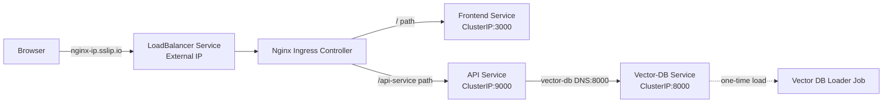

# Deployment & Scaling

## Set up

### API's to enable in GCP before you begin
Search for each of these in the GCP search bar and click enable to enable these API's
* Compute Engine API
* Service Usage API
* Cloud Resource Manager API
* Artifact Registry API

#### Setup GCP Service Account for deployment
- Here are the step to create a service account:
- To setup a service account you will need to go to [GCP Console](https://console.cloud.google.com/home/dashboard), search for  "Service accounts" from the top search box. or go to: "IAM & Admins" > "Service accounts" from the top-left menu and create a new service account called "deployment".
- Give the following roles:
- For `deployment`:
    - Compute Admin
    - Compute OS Login
    - Artifact Registry Administrator
    - Kubernetes Engine Admin
    - Service Account User
    - Storage Admin
- Then click done.
- This will create a service account
- On the right "Actions" column click the vertical ... and select "Create key". A prompt for Create private key for "deployment" will appear select "JSON" and click create. This will download a Private key json file to your computer. Copy this json file into the **secrets** folder.
- Rename the json key file to `deployment.json`
- Follow the same process Create another service account called `gcp-service`
- For `gcp-service` give the following roles:
    - Storage Object Viewer
    - Vertex AI Administrator
    - Artifact Registry Reader
- Then click done.
- This will create a service account
- On the right "Actions" column click the vertical ... and select "Create key". A prompt for Create private key for "gcp-service" will appear select "JSON" and click create. This will download a Private key json file to your computer. Copy this json file into the **secrets** folder.
- Rename the json key file to `gcp-service.json`

### Setup Docker Container (Pulumi, Docker, Kubernetes)

#### Run `deployment` container
- cd into `deployment`
- Go into `docker-shell.sh` and change `GCP_PROJECT` to your project id
- Run `sh docker-shell.sh`

- Check versions of tools:
```
gcloud --version
pulumi version
kubectl version --client
```

- Check to make sure you are authenticated to GCP
- Run `gcloud auth list`

Now we have a Docker container that connects to your GCP and can create VMs, deploy containers all from the command line

### SSH Setup
#### Configuring OS Login for service account
Run this within the `deployment` container
```
gcloud compute project-info add-metadata --project <YOUR GCP_PROJECT> --metadata enable-oslogin=TRUE
```

#### Create SSH key for service account
```
cd /secrets
ssh-keygen -f ssh-key-deployment
cd /app
```

#### Providing public SSH keys to instances
```
gcloud compute os-login ssh-keys add --key-file=/secrets/ssh-key-deployment.pub
```
From the output of the above command keep note of the username. Here is a snippet of the output
```
- accountId: ac215-project
    gid: '3906553998'
    homeDirectory: /home/sa_100110341521630214262
    name: users/deployment@ac215-project.iam.gserviceaccount.com/projects/ac215-project
    operatingSystemType: LINUX
    primary: true
    uid: '3906553998'
	...
    username: sa_100110341521630214262
```
The username is `sa_100110341521630214262`


## Deployment with Scaling using Kubernetes

In this section we will deploy the app to a K8s cluster.

### Build and Push Docker Containers to GCR
**This step is only required if you have NOT already done this**
- cd into `deploy_images`
- When setting up pulumi for the first time run:
```
pulumi stack init dev
pulumi config set gcp:project <your-project> --stack dev
```

This will save all the deployment states to a GCP bucket

- If a stack has already been setup, you can preview deployment using:
```
pulumi preview --stack dev
```

- To build & push images run (This will take a while since we need to build 3 containers):
```
pulumi up --stack dev -y
```

## Create & Deploy Cluster
- cd into `deploy_k8s` from the `deployment` folder
- When setting up pulumi for the first time run:
```
pulumi stack init dev
pulumi config set gcp:project ac215-project
pulumi config set security:gcp_service_account_email deployment@ac215-project.iam.gserviceaccount.com --stack dev
pulumi config set security:gcp_ksa_service_account_email gcp-service@ac215-project.iam.gserviceaccount.com --stack dev
```
This will save all your deployment states to a GCP bucket

- If a stack has already been setup, you can preview deployment using:
```
pulumi preview --stack dev --refresh
```

- To create a cluster and deploy all our container images run:
```
pulumi up --stack dev --refresh -y
```

Here is how the various services communicate between each other in the Kubernetes cluster.



### Try some kubectl commands
```
kubectl get all
kubectl get all --all-namespaces
kubectl get pods --all-namespaces
```

```
kubectl get componentstatuses
kubectl get nodes
```

### If you want to shell into a container in a Pod
```
kubectl get pods --namespace=cheese-app-namespace
kubectl get pod api-c4fb784b-2llgs --namespace=cheese-app-namespace
kubectl exec --stdin --tty api-c4fb784b-2llgs --namespace=cheese-app-namespace  -- /bin/bash
```

### View the App
* From the terminal view the results of Pulumi
```
Outputs:
    app_url         : "http://34.9.143.147.sslip.io"
    cluster_endpoint: "104.197.105.203"
    cluster_name    : "cheese-app-cluster"
    ingress_name    : "nginx-ingress"
    kubeconfig      : [secret]
    namespace       : "cheese-app-namespace"
    nginx_ingress_ip: "34.9.143.147"
```
* Go to `app_url`

### Delete Cluster
```
pulumi destroy --stack dev --refresh -y
```

---


## Create Simple Kubernetes Cluster Tutorial

### API's to enable in GCP for Project
We have already done this in the deployment tutorial but in case you have not done that step. Search for each of these in the GCP search bar and click enable to enable these API's
* Compute Engine API
* Service Usage API
* Cloud Resource Manager API
* Google Container Registry API
* Kubernetes Engine API

### Start Deployment Docker Container
-  `cd deployment`
- Run `sh docker-shell.sh` or `docker-shell.bat` for windows
- Check versions of tools
`gcloud --version`
`kubectl version`
`kubectl version --client`

- Check if make sure you are authenticated to GCP
- Run `gcloud auth list`


### Create Cluster
```
gcloud container clusters create test-cluster --num-nodes 2 --zone us-east1-c
```

### Checkout the cluster in GCP
* Go to the Kubernetes Engine menu item to see the cluster details
    - Click on the cluster name to see the cluster details
    - Click on the Nodes tab to view the nodes
    - Click on any node to see the pods running in the node
* Go to the Compute Engine menu item to see the VMs in the cluster

### Try some kubectl commands
```
kubectl get all
kubectl get all --all-namespaces
kubectl get pods --all-namespaces
```

```
kubectl get componentstatuses
kubectl get nodes
```

### Deploy the App
```
kubectl apply -f deploy-k8s-tic-tac-toe.yml
```

### Get the Loadbalancer external IP
```
kubectl get services
```

### View the App
* Copy the `External IP` from the `kubectl get services`
* Go to `http://<YOUR EXTERNAL IP>`


### Delete Cluster
```
gcloud container clusters delete test-cluster --zone us-east1-c
```


---


## Debugging Containers

If you want to debug any of the containers to see if something is wrong

* View running containers
```
sudo docker container ls
```

* View images
```
sudo docker image ls
```

* View logs
```
sudo docker container logs api-service -f
sudo docker container logs frontend -f
sudo docker container logs nginx -f
```

* Get into shell
```
sudo docker exec -it api-service /bin/bash
sudo docker exec -it frontend /bin/bash
sudo docker exec -it nginx /bin/bash
```


```
# Check the init container logs:
kubectl logs -n cheese-app-cluster-namespace job/vector-db-loader -c wait-for-chromadb

# Check the main container logs:
kubectl logs -n cheese-app-cluster-namespace job/vector-db-loader -c vector-db-loader

# Check the job status:
kubectl describe job vector-db-loader -n cheese-app-cluster-namespace


# First, find the pod name for your job
kubectl get pods -n cheese-app-cluster-namespace | grep vector-db-loader

# Then get the logs from that pod (replace <pod-name> with the actual name)
kubectl logs -n cheese-app-cluster-namespace <pod-name>
kubectl logs -n cheese-app-cluster-namespace vector-db-loader-9gr5m

# If you want to see logs from the init container specifically
kubectl logs -n cheese-app-cluster-namespace <pod-name> -c wait-for-chromadb
kubectl logs -n cheese-app-cluster-namespace vector-db-loader-wlfdx -c wait-for-chromadb

# If you want to see logs from the main container
kubectl logs -n cheese-app-cluster-namespace <pod-name> -c vector-db-loader
kubectl logs -n cheese-app-cluster-namespace vector-db-loader-wlfdx -c vector-db-loader

# You can also get logs directly from the job (this will show logs from the most recent pod)
kubectl logs job/vector-db-loader -n cheese-app-cluster-namespace

# To see previous logs if the pod has restarted
kubectl logs job/vector-db-loader -n cheese-app-cluster-namespace --previous


# View logs from the current API pod
kubectl logs deployment/api -n cheese-app-cluster-namespace

# Follow the logs
kubectl logs deployment/api -n cheese-app-cluster-namespace -f
```
